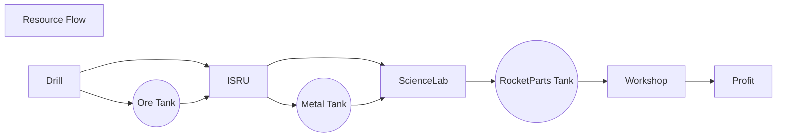

<!--
resourceFlow.md v1.0.1.0
SimpleConstruction! (SCON)
created: 26 Feb 2022
updated: 26 Feb 2022
-->

https://mermaid-js.github.io/mermaid/

<i class="fa fa-gear fa-spin fa-2x" style="color: firebrick"></i>

# SimpleConstruction! (SCON!)

[Home](/index.md)

## Resource Flow

<!-- this file CC BY-ND 3.0 Unported by zer0Kerbal -->
