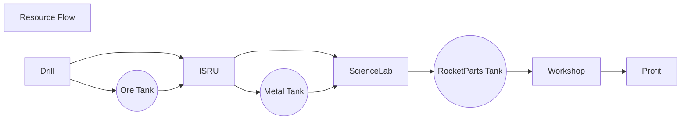

<!--
resourceFlow.md v1.0.1.0
SimpleConstruction! (SCON)
created: 26 Feb 2022
updated: 26 Feb 2022
-->

<i class="fa fa-gear fa-spin fa-3x" style="color: firebrick"></i>

# SimpleConstruction! (SCON)

[Home](/index.md)

## Resource Flow

<!-- https://mermaid-js.github.io/mermaid/ -->

<!-- this file CC BY-ND 4.0 by zer0Kerbal -->
