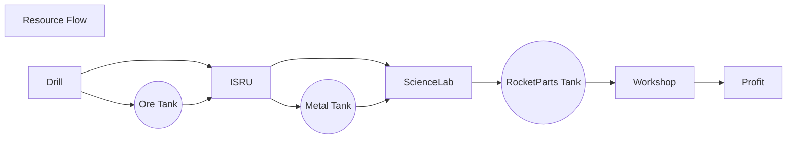

<!-- https://mermaid-js.github.io/mermaid/ -->
<!--
resourceFlow.md v1.0.0.0
SimpleConstruction! (SCON)
created: 26 Feb 2022
updated: 26 Feb 2022
-->

[Home](https://zer0kerbal.github.io/SimpleConstruction)

<i class="fab fa-github"></i>

<i class="fa fa-gear fa-spin fa-2x" style="color: firebrick"></i>
# SimpleConstruction! (SCON!)

## Resource Flow

<!-- this file CC BY-NC-ND 3.0 Unported by zer0Kerbal -->