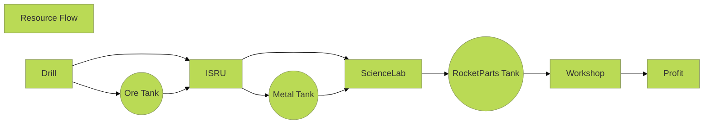

<!--resourceFlow.md v1.1.3.0.
SimpleConstruction! (SCON)
created: 01 Feb 2020
updated: 18 Jun 2023
-->

<i class="fa fa-gear fa-spin fa-3x" style="color: firebrick"></i>

## [SimpleConstruction! (SCON)][mod]

[Home](/index.md)

## Resource Flow

THIS FILE: CC BY-ND 4.0 by [zer0Kerbal](https://github.com/zer0Kerbal)
  used with express permission from zer0Kerbal

[mod]: https://www.curseforge.com/kerbal/ksp-mods/SimpleConstruction "SimpleConstruction! (SCON)"