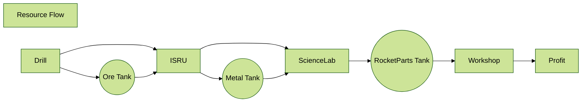

<!-- readme.md v4.0.99.34
SimpleConstruction! (SCON)
created: 17 Jul 2017
updated: 18 Jun 2023

TEMPLATE: readme.md v1.7.4.2
created: 17 Jul 2017
updated: 18 May 2023

THIS FILE: CC BY-ND 4.0 by zer0Kerbal -->
# [SimpleConstruction! (SCON)][CURSFG:url]

[![SimpleConstruction! (SCON)][SHD:mod]][CURSFG:url]  
[![KSP version][KSP:shd]][KSP:url] [![License][LIC:shd]][LIC:url]  
[![Curseforge][CURSFG:shd]][CURSFG:url] [![GitHub][GITHUB:shd]][GITHUB:url] [![Pages][SHD:pgs]][pages]

![MOD-NAME][SHD:dll]

This addon aims to provide simple craft building capability in flight mode with stock parts and streamlined IRSU mining for Kerbal Space Program.

## By [`zer0Kerbal`][zedk], originally by [`MatterBeam`][matterbeam] and then by [`RealGecko`][realgecko]; then previously from [`EricWi`][ericwi]

adopted with *express* permission and brought to you by *KerbSimpleCo*

<!--  -->

### Resource Flow

### Preamble by [`MatterBeam`][matterbeam]

> After testing out Extraplanetary Launchpads and Roverdude's MK/OKS, [`MatterBeam`][matterbeam] had the idea of creating a simple, user friendly mod that would allow you to build rockets without taking a 200MB hit to RAM or having to juggle multitudes of resource pathways. If you know how to set up a drill, ISRU and a fuel tank for an Ore to Fuel conversion, then you should know how to build rockets.

### Features

* No extra parts
* No RAM usage
* Added functionality for the Mobile Processing Lab in the late game
* Simple, configurable and adds levels of depth to the gameplay without a learning curve
* Ore --> Metal --> RocketParts --> rockets!

### Cabin notes by [zer0Kerbal][zedk]

* Will remain prerelease until [taniwha][taniwha] releases Extraplanetary Launchpads as *release* instead of alpha/beta/prerelease
* `WIP` - work in progress
* Am open to adding more features, great project for someone!
* I have not personally tested the patches
* Known issue(s)
  * If the offset/rotation gizmo's are used on the docking ports, the spawn location might be off. This is a known issue and a feature request has been sent to [`taniwha`][taniwha]
  * Kerbalism compatibility is considered EXPERIMENTAL.
  * certain builds may require no RocketParts and time to complete. We are aware of this and any assistance with this issue would be appreciated.

### See More

>* the latest version of this readme is always found on [GitHub][GITHUB:url]
>* [ChangeLog][chlog] for more details of changes
>* [Discussions][discu] or [forums][forum] for discussions and news
>* [FAKQ][fakq]
>* [GitHub Pages][pages]
>* [Known Issues][issue] for more details of feature requests and known issues
>* [Marketing Slicks][markt]
>* [Parts Catalog][parts] for part pictures
>* [Online Manual (heavily a WIP)](https://zer0kerbal.github.io/NotSoSimpleConstruction/FAKQ/stakes.html)

### Documentation

* this is the FULL [Extraplanetary Launchpads PDF](http://taniwha.org/~bill/EL_Manual.pdf) manual and not written specifically for [SimpleConstruction!][CURSFG:url] and is dated
* an unfinished/experimental (heavily wip) html version is available [here](https://zer0kerbal.github.io/NotSoSimpleConstruction/FAKQ/stakes.html)

  

> Review by [`Kottabos Gaming`](https://forum.kerbalspaceprogram.com/index.php?/profile/36583-*/)
>
> 

### Localizations

#### [SimpleConstruction!][forum]

>* ![English][EN] English
>* ![Dutch][NL] Dutch - bedankt [x13x54](https://github.com/x13x54)
>* ![Français][FR] French (Français) - merci beaucoup [izeau (Jean Dupouy)](https://github.com/izeau)
>* ![(Deutsch)][DE] German (Deutsch) - danke *unknown*
>* ![Chinese (简体中文)][CN] Chinese (简体中文) - xièxiè - *wèizhī* (谢谢 - 未知)
>* ***your translation here***

#### [Extraplanetary Launchpads](https://github.com/taniwha/Extraplanetary-Launchpads)

>*  English
>*  Brazilian (Português Brasil)
>*  Chinese (简体中文)
>*  Dutch
>*  French (Français)
>* ***your translation here***
>
> Kindly help translate [Extraplanetary Launchpads][xpl] by [`taniwha`][taniwha] See above for instructions.  [Github Repo](https://github.com/taniwha/Extraplanetary-Launchpads)

### Help Wanted

> * Compatibility patches
> * Testing of experimental features:
>   * A config that turns a STOCK part (Klaw) into a recycler
>   * discussion and download on [GitHub](https://github.com/zer0Kerbal/SimpleConstruction/discussions/145)
> * Contracts for these glorious parts
> * Sample crafts/subassemblies
> * Variant textures and model updates (add/improve: lights, iva, hatches et al)
> * Converting from FireSpitter to Stock and/or KSPWheel  
> * Marketing Images and Videos such as hero shots, animated gifs, short highlights
> * Translations: See the [README's in the Localization folder](https://github.com/zer0Kerbal/zer0Kerbal/blob/master/Localization/readme.md) for instructions for adding or improving translations. There is also the [quick start guide(s)](https://github.com/zer0Kerbal/zer0Kerbal/blob/master/Localization/quickstart.md). [GitHub][GitHub:url] push is the best way to contribute. *Additions and corrections welcome!*
> * Have a request? Glad to have them, kindly submit through [GitHub][issue].

### Installation Directions

Most recent releases only available via CurseForge/OverWolf Website/App

### Dependencies

* 📌 Pinned
  * Dependencies:
    * [ModularManagement (MM)](https://curseforge.com/kerbal/ksp-mods/ModularManagement) or [Module Manager](https://forum.kerbalspaceprogram.com/index.php?/topic/50533-*/)
    * [Kerbal Space Program][KSP:url] [![Kerbal Space Program][KSP:shd]][KSP:url]

#### Recommends

* [Foundations (FND)](https://curseforge.com/kerbal/ksp-mods/Foundations) <i><small>Helps prevent ground constructions from floating away</small></i>
* [GPO (Goo Pumps & Oils') Speed Pump (GPO)](https://curseforge.com/kerbal/ksp-mods/GPOSpeedPump)
* [KerbalStats](https://forum.kerbalspaceprogram.com/index.php?/topic/89285-*/) <i><small>keeps tract of time on task, which can increase task efficiency</small></i>
* [Keridian Dynamics Vessel Assembly (KDVA)](https://curseforge.com/kerbal/ksp-mods/KeridianDynamics) <i><small>lots of stockalike parts</small></i>
* [More: Hitchhikers (MHH)](https://curseforge.com/kerbal/ksp-mods/morehitchhikers)
* [Not So SimpleConstructon! (NSSC)](https://curseforge.com/kerbal/ksp-mods/NotSoSimpleConstructon) <i><small>adds recyling and surveying</small></i>
* [SimpleLogistics! (SLOG)](https://curseforge.com/kerbal/ksp-mods/SimpleLogistics)

#### Suggests Mods

* that benefit SimpleConstruction! (SCON)
  * [Kaboom! (BOOM)](https://curseforge.com/kerbal/ksp-mods/Kaboom) <i><small>another way to not go to space today</small></i>
  * [On Demand Fuel Cells (ODFC)](https://curseforge.com/kerbal/ksp-mods/OnDemandFuelCells)
  * [ISRU Thanks But No Tanks (QBTT)](https://curseforge.com/kerbal/ksp-mods/isruthanksbutnotanks)
  * [Docking Port Descriptions (DPD)](https://curseforge.com/kerbal/ksp-mods/DockingPortDescriptions)
  * [SimpleNotes! (NOTE)](https://curseforge.com/kerbal/ksp-mods/Notes)
* by [zer0Kerbal][zedk]
* [Adjustable Mod Panel (KAMP)](https://curseforge.com/kerbal/ksp-mods/AdjustableModPanel)
* [Biomatic (BIO)](https://curseforge.com/kerbal/ksp-mods/Biomatic)
* [Exception Detector (EXCD)](https://curseforge.com/kerbal/ksp-mods/ExceptionDetector)
* [Field Training Facility (FTF)](https://curseforge.com/kerbal/ksp-mods/FieldTrainingFacility)
* [Field Training Lab (FTL)](https://curseforge.com/kerbal/ksp-mods/FieldTrainingLab)
* [MoarKerbals (MOAR)](https://curseforge.com/kerbal/ksp-mods/MoarKerbals)
* [Near Future Rovers (NFR)](https://curseforge.com/kerbal/ksp-mods/NearFutureRovers)
* [Precise Maneuver (PM)](https://curseforge.com/kerbal/ksp-mods/PreciseManeuver)
* [Rover Anti Gravity System (LARAGS)](https://curseforge.com/kerbal/ksp-mods/roverantigravitysystem)
* [ScrapYard (SCRAP)](https://curseforge.com/kerbal/ksp-mods/ScrapYard)
* [Stack Inline Lights (SIL)](https://curseforge.com/kerbal/ksp-mods/StackInlineLights)
* Science!
  * [Mkerb Science Instruments](https://curseforge.com/kerbal/ksp-mods/ScienceInstruments)
  * [OScience Laboratories (OSL)](https://curseforge.com/kerbal/ksp-mods/OScienceLaboratories)
  * [Papa Kerballini's Pizza (PIZZA)](https://curseforge.com/kerbal/ksp-mods/Pizza)
  * [Solar Science (SOL)](https://curseforge.com/kerbal/ksp-mods/SolarScience)
* [Alternative Resource Panel](https://legacy.curseforge.com/kerbal/ksp-mods/alternate-resource-panel)
  * [Olympic's ARP Icons (ARPI)](https://curseforge.com/kerbal/ksp-mods/arpicons)
* [Community Trait Icons](https://forum.kerbalspaceprogram.com/index.php?/topic/162509-*/)
* [Kerbal Attachment System (KAS)](https://curseforge.com/kerbal/ksp-mods/kerbal-attachment-system-kas)
* [Kerbal Inventory System (KIS)](https://curseforge.com/kerbal/ksp-mods/kerbal-inventory-system-kis)
* [Six Crew Science Lab](https://spacedock.info/mod/248) <i><small>simple patch that re-adds the missing four seats</i></small>
* [Stockalike Mining Extension (smx)](https://forum.kerbalspaceprogram.com/index.php?/topic/130325-*/)
* Fuel Switchers:
  * [B9 Part Switch](https://forum.kerbalspaceprogram.com/topic/140541-*/)
  * [Interstellar Fuel Switch Core](https://legacy.curseforge.com/kerbal/ksp-mods/interstellar-fuel-switch)
  * [FireSpitter Core](https://legacy.curseforge.com/kerbal/ksp-mods/firespitter)

#### Supports

* [Blizzy's Toolbar](https://forum.kerbalspaceprogram.com/index.php?/topic/161857-*/)
* [Community Resource Pack](https://legacy.curseforge.com/kerbal/ksp-mods/community-resource-pack)
* [Extraplanetary Launchpads - No More Production](https://github.com/theRagingIrishman/USI_EL)
* [Kerbal Planetary Base Systems (KPBS)](https://curseforge.com/kerbal/ksp-mods/kerbal-planetary-base-systems)
* [Kerbalism (kerb)](https://forum.kerbalspaceprogram.com/index.php?/topic/190382-*/) - Experimental
* [Kethane/KethanePlus](http://forum.kerbalspaceprogram.com/index.php?/topic/119480-*/)
* [Toolbar Controller](https://forum.kerbalspaceprogram.com/index.php?/topic/169509-*/)
* [TweakScale (twk)](https://curseforge.com/kerbal/ksp-mods/TweakScale)
* [Station Parts Expansion Redux (SSPX)](https://curseforge.com/kerbal/ksp-mods/stockalike-station-parts-expansion-redux)

#### Conflicts

* [Extraplanetary Launchpads (xpl)][xpl]

### Tags

* parts, plugin, config, flags, convenience, editor, resources, crewed, uncrewed

  
<b>red box below is a link to forum post on how to get support</b>

  <a href="https://forum.kerbalspaceprogram.com/index.php?/topic/83212-*">
    

</a>
  
Be Kind: Lithobrake, not jakebrake! Keep your Module Manager up to date

### Credits and Special Thanks

>* [`taniwha`][taniwha] for creating [Extraplanetary Launchpads][xpl].
>* [`MatterBeam`][matterbeam] for creating this cool mod.
>* [`RealGecko`][realgecko] and [`Ericwi`][ericwi] - previous maintainers
>* [`eengie`](https://www.reddit.com/user/eengie/) o7
>* see [Attribution.md][attrb] for more comprehensive list

### Legal Mumbo Jumbo (License *provenance*)

#### Author (3) - [`zer0Kerbal`][zedk]
>
> Forum: [Thread][forum] - Source: [GitHub][GITHUB:url] - Download [CurseForge][CURSFG:url]  
> License: [![License][LIC:shd]][LIC:url]

#### Maintainer (2) - [`EricWI`][ericwi]
>
> [Thread][2:thr] - [GitHub][2:dnl] - Source: [GitHub][2:src]  
> License: [![License][2:shd]][2:url] [![License][2:log]][2:url]

#### Author (1) - [`RealGecko`][realgecko]
>
> [Thread][1:thr] - [SpaceDock][1:dnl] - Source: [GitHub][1:src]  
> License: [![License][1:shd]][1:url] [![License][1:log]][1:url]  
> <small><i>the license was changed around this time.</i></small>

#### Original Author (ROOT) (0): [`MatterBeam`][matterbeam]
>
> [Thread][0:thr]  - [SpaceDock][0:dnl] - Source: [GitHub][0:src]  
> License: [![License][0:shd]][0:url] [![License][0:log]][0:url]

#### Disclaimer(s)

> This mod contains [`taniwha`][taniwha]'s Launchpad.dll and textures licensed from [Extraplanetary Launchpads][xpl].
>
>
>* ***All bundled mods are distributed under their own licenses***  
>* ***All assets, including but not limited to: animations, models, sounds and textures are distributed under their own licenses. [![License][LIC:sp:shd]][LIC:sp:url]***
>
>* see [Notices][notic] for more *legal Mumbo Jumbo*

### How to support this and other great mods by [`zer0Kerbal`][zedk]

Comment, click, like, share, up-vote, subscribe

> ***Completely voluntary, absolutely amazing, and really does help out a lot!***  
> *and it is true.*

[![Support][PAYPAL:img]][PAYPAL:url] [![Patreon][PATREON:img]][PATREON:url]

<!-- links -->
[attrb]: https://raw.githubusercontent.com/zer0Kerbal/SimpleConstruction/master/Attribution.md "Attribution"
[chlog]: https://raw.githubusercontent.com/zer0Kerbal/SimpleConstruction/master/changelog.md "Changelog"
[discu]: https://github.com/zer0Kerbal/SimpleConstruction/discussions "Discussions"
[fakq]: https://zer0kerbal.github.io/SimpleConstruction/FAKQ "Frequently Asked Kerbal Questions"
[forum]: https://forum.kerbalspaceprogram.com/index.php?/topic/191424-*/ "SimpleConstruction! (SCON)"
[issue]: https://github.com/zer0Kerbal/SimpleConstruction/issues "GitHub Issues"
[markt]: https://zer0kerbal.github.io/SimpleConstruction/Marketing "Marketing Slicks"
[notic]: https://zer0kerbal.github.io/SimpleConstruction/Notices "Notices"
[pages]: https://zer0kerbal.github.io/SimpleConstruction "GitHub Pages"
[parts]: https://zer0kerbal.github.io/SimpleConstruction/PartsCatalog "Parts Catalog"

<!--- shields -->
[SHD:dll]: https://img.shields.io/endpoint?url=https://raw.githubusercontent.com/zer0Kerbal/SimpleConstruction/master/json/dll.json
[SHD:mod]: https://img.shields.io/endpoint?url=https://raw.githubusercontent.com/zer0Kerbal/SimpleConstruction/master/json/mod.json
[SHD:pgs]: https://img.shields.io/badge/GitHub-Pages-white?style=plastic&labelColor=9cf&logoColor=181717&logo=github "GitHub IO"

<!--- mod provenance -->
[2:dnl]: https://github.com/EricKerman/SimpleConstruction "GitHub Repo"
[2:src]: https://github.com/EricKerman/SimpleConstruction "GitHub"
[2:thr]: https://forum.kerbalspaceprogram.com/index.php?/topic/173609-*/ "EricWI's"

[1:dnl]: https://spacedock.info/mod/59/SimpleConstruction "SpaceDock"
[1:src]: https://github.com/Real-Gecko/KSP-SimpleConstruction "GitHub"
[1:thr]: https://forum.kerbalspaceprogram.com/index.php?/topic/152575-*/ "RealGecko's"

[0:dnl]: https://spacedock.info/mod/59/SimpleConstruction  "SpaceDock"
[0:src]: https://github.com/matterbeam/SimpleConstruction "GitHub"
[0:thr]: https://forum.kerbalspaceprogram.com/index.php?/topic/131588-*/ "MatterBeam's"

<!--- license provenance-->
[LIC:url]: https://www.gnu.org/licenses/gpl-3.0-standalone.html "GPL-3.0"  
[LIC:shd]: https://img.shields.io/endpoint?url=https://raw.githubusercontent.com/zer0Kerbal/SimpleConstruction/master/json/license.json "GPL-3.0"

[2:url]: https://opensource.org/licenses/MIT "Expat-MIT"
[2:log]: https://i.postimg.cc/bvjfsMP5/MIT-17x17.png "Expat-MIT"
[2:shd]: https://img.shields.io/badge/License-Expat/MIT-3DA639?labelColor=black&logoColor=3DA639&logo=OpenSourceInitiative&style=plastic "Expat-MIT"

[1:url]: https://opensource.org/licenses/MIT "Expat-MIT"
[1:log]: https://i.postimg.cc/bvjfsMP5/MIT-17x17.png "Expat-MIT"
[1:shd]: https://img.shields.io/badge/License-Expat/MIT-3DA639?labelColor=black&logoColor=3DA639&logo=OpenSourceInitiative&style=plastic "Expat-MIT"

[0:url]: https://creativecommons.org/licenses/by-nc-sa/4.0/ "CC BY-NC-SA 4.0"
[0:log]: https://licensebuttons.net/i/l/by-nc-sa/transparent/33/66/99/76x22.png "CC BY-NC-SA 4.0"
[0:shd]: https://img.shields.io/badge/License-CC%20BY--NC--SA%204.0-ef9421?labelColor=black&style=plastic&logoColor=ef9421&logo=creativecommons "CC BY-NC-SA 4.0"

[LIC:sp:url]: https://en.wikipedia.org/wiki/All_rights_reserved "All Rights Reserved"
[LIC:sp:shd]: https://img.shields.io/badge/License-All%20Rights%20Reserved-white?labelColor=black&style=plastic "All Rights Reserved"

<!--- release links -->
[CURSFG:url]: https://curseforge.com/kerbal/ksp-mods/simpleconstruction "Curseforge"
[CURSFG:shd]: https://img.shields.io/badge/CurseForge-Link-CCFF00.svg?labelColor=6441A4&style=plastic&logo=curseforge "Curseforge"

[GITHUB:url]: https://github.com/zer0Kerbal/SimpleConstruction/ "GitHub"
[GITHUB:shd]: https://img.shields.io/badge/Github-Link-CCFF00.svg?labelColor=181717&style=plastic&logo=github "GitHub"

<!-- Kerbal Space Program -->
[KSP:url]: https://kerbalspaceprogram.com/ "Kerbal Space Program"
[KSP:shd]: https://img.shields.io/endpoint?url=https://raw.githubusercontent.com/zer0Kerbal/SimpleConstruction/master/json/ksp.json "Kerbal Space Program"

<!--- statics -->
[xpl]: https://forum.kerbalspaceprogram.com/index.php?/topic/54284-*/ "ExtraPlanetary Launchpads"

[ericwi]: https://forum.kerbalspaceprogram.com/index.php?/profile/152716-*/ "EricWi"
[matterbeam]: http://forum.kerbalspaceprogram.com/index.php?/profile/133334-*/ "MatterBeam"
[realgecko]: https://forum.kerbalspaceprogram.com/index.php?/profile/162682-*/ "RealGecko"
[taniwha]: https://forum.kerbalspaceprogram.com/index.php?/profile/57176-*/ "Taniwha"
[zedk]: https://forum.kerbalspaceprogram.com/index.php?/profile/190933-*/ "zer0Kerbal"

<!-- financial support -->
[PAYPAL:img]: https://img.shields.io/badge/Buy%20me%20some%20-LFO-BADA55?style=for-the-badge&logo=paypal&labelColor=FFDD00/ "PayPal"
[PAYPAL:url]: https://www.paypal.com/donate/?hosted_button_id=DC22YHMEJREKL "PayPal"
[PATREON:img]: https://img.shields.io/badge/Patreon%20-Patreonize-FF424D?style=for-the-badge&logo=patreon/ "Patreon"
[PATREON:url]: https://www.patreon.com/zer0Kerbal/membership "Patreon"

<!-- Localization -->
[lreadme]: https://github.com/zer0Kerbal/zer0Kerbal/blob/master/Localization/readme.md "Localization Readme"
[qstart]: https://github.com/zer0Kerbal/zer0Kerbal/blob/master/Localization/quickstart.md "Quickstart"
[EN]: https://raw.githubusercontent.com/zer0Kerbal/zer0Kerbal/zed'K/img/EN.png "English"
[BR]: https://raw.githubusercontent.com/zer0Kerbal/zer0Kerbal/master/img/BR.png "Brazialian (Português Brasil)"
[CN]: https://raw.githubusercontent.com/zer0Kerbal/zer0Kerbal/master/img/CH.png "Simplified Chinese (中文)"
[DE]: https://raw.githubusercontent.com/zer0Kerbal/zer0Kerbal/master/img/DE.png "danke - German (Deutsch)"
[FR]: https://raw.githubusercontent.com/zer0Kerbal/zer0Kerbal/master/img/FR.png "merci French (Français)"
[NL]: https://raw.githubusercontent.com/zer0Kerbal/zer0Kerbal/master/img/NL.png "bedanke - Dutch"

[curseforge]: https://curseforge.com/members/zer0kerbal/projects
[reddit]: https://www.reddit.com/user/zer0Kerbal
[twitch]: https://www.twitch.tv/zer0kerbal
[twitter]: https://twitter.com/zer0Kerbal
[youtube]: https://www.youtube.com/@zer0Kerbal
[steam]: https://steamcommunity.com/id/zeroKerbal
[projects]: https://zer0kerbal.github.io/zer0Kerbal/projects.html

#### Connect with me

Track progress: issues [here][issue] and projects [here](https://github.com/zer0Kerbal/SimpleConstruction/projects/) along with **[The Short List](https://github.com/users/zer0Kerbal/projects/27)**

[][zedk] [][curseforge] [][reddit] [][PATREON:url] [][youtube] [][twitch] [][PAYPAL:url] [][steam] [][twitter] [][projects] 